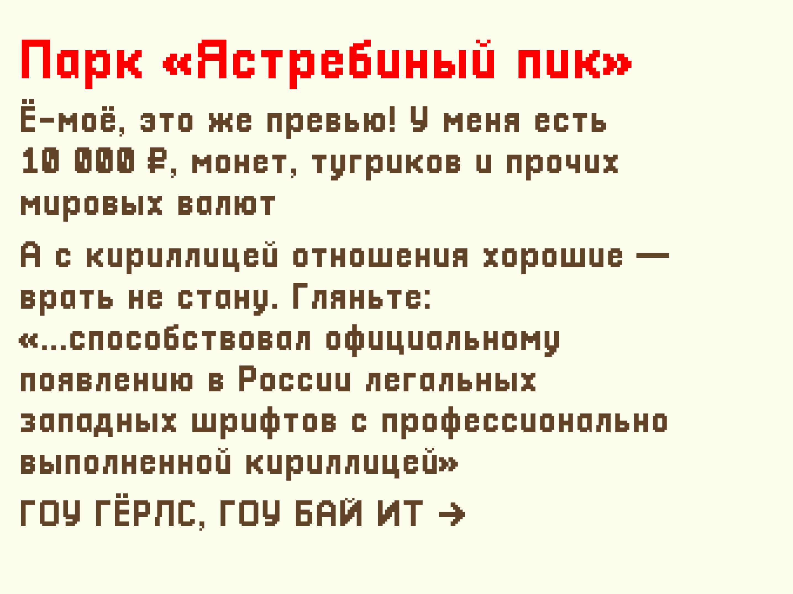
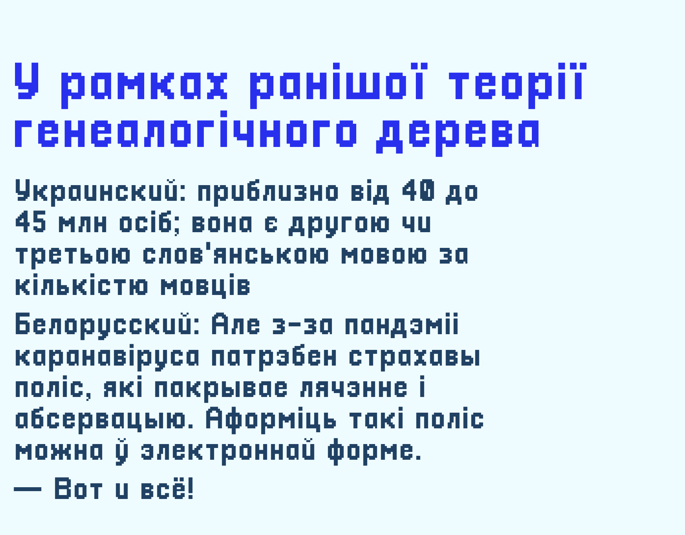

# Pix Cyrillic

Кириллическая версия шрифта [Pixellari](https://github.com/zedseven/Pixellari). Автор оригинала — Zacchary Dempsey-Plante [@zedseven](https://github.com/zedseven)

Поддерживает русский, украинский и белорусский языки. Собран в [BitFontMaker 2](https://www.pentacom.jp/pentacom/bitfontmaker2/), затем отредактирован в [FontLab](https://www.fontlab.com)

`PixCyrillic.ttf` — базовая версия  
`PixCyrillic-AShortHikeEdition.ttf` — со стилизованной буквой «а», как в игре [A Short Hike](https://ashorthike.com)

Вот как выглядит A Short Hike Edition:

