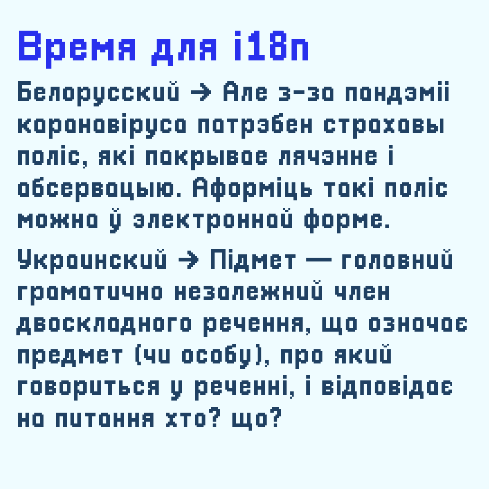

# Pix Cyrillic

Кириллическая версия шрифта [Pixellari](https://github.com/zedseven/Pixellari). Автор оригинала — Zacchary Dempsey-Plante [@zedseven](https://github.com/zedseven)

Поддерживает русский, украинский и белорусский языки. Собран в [BitFontMaker 2](https://www.pentacom.jp/pentacom/bitfontmaker2/), затем отредактирован в [FontLab](https://www.fontlab.com)

`PixCyrillic.ttf` — для десктопа, 35 КБ  
`web/PixCyrillic.woff2` — для сайтов, 6 КБ

В шрифт встроена стилизованная буква «а», как в игре [A Short Hike](https://ashorthike.com). Доступна как альтернативный символ: `font-feature-settings: 'cv01';`

И в отдельном файле: `PixCyrillic-AShortHikeEdition.ttf`

